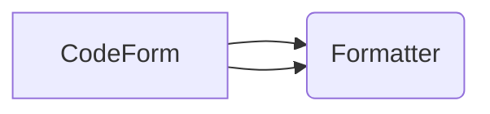

# CodeForm
Code formatter/beautifier for **Kotlin** programming language

## Components

## Kotlin Testcases
|Testcase  |V 0.1.0     |
|----------|------------|
|Test1     ||
|Test2     ||
|Test3     ||
|Test4     ||
|Test5     ||
|Test6     ||
|Test7     ||

## Extensions
### Status
|Version   |VSCode      |
|----------|------------|
|0.1.0     ||

### Setup extension
- To setup extension project `yo code`

### Run extension
- In vscode open `extension.js` and push <kbd>F5</kbd> and select `VS Code Extension Developement`
- In new vscode window, hit <kbd>Ctrl</kbd> + <kbd>Shift</kbd> + <kbd>P</kbd> and search select `Open Code Formatter Kotlin`

### Test extension
- Install [Test Runner](https://marketplace.visualstudio.com/items?itemName=ms-vscode.extension-test-runner)
- From left side of IDE, Under Extensions, Click on `testing` button

## Future Work
-  Setup vscode extension
-  Deploy in marketplace
-  Format code indentation
-  Custom commands to customize formatter
-  Setup unit tests in `tests` directory

## Rules for commits
1. New Testcase: `Setup testcase no [NUMBER], [DESCIPTION]`, last one was 8
1. Update Testcase: `Update testcase no [NUMBER], [DESCIPTION]`
1. Update for Formatted Testcases: `Update formatted testcases [TRY_NUMBER]`
